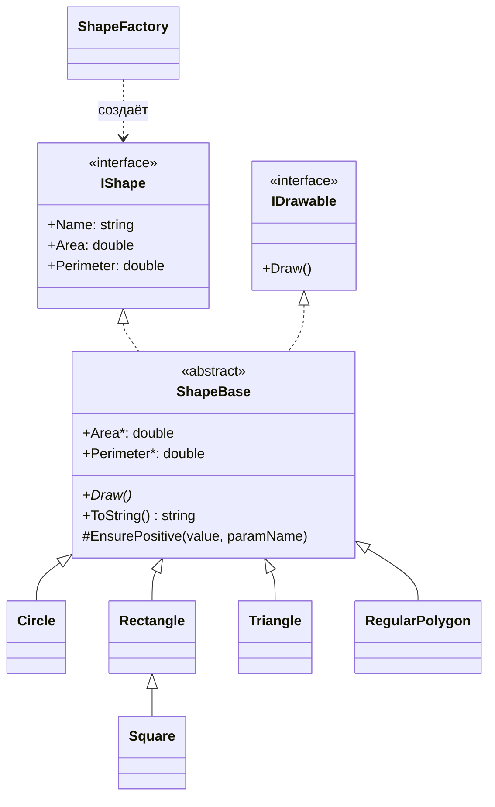

# ShapesDemo

Тестовое задание: консольная программа на C#, которая выводит на экран геометрические фигуры
(круг, квадрат, прямоугольник, треугольник, правильный многоугольник), считает их площадь
и периметр и показывает применение ООП.

## Запуск

Нужен [.NET 8 SDK](https://dotnet.microsoft.com/download/dotnet/8.0).

```bash
dotnet run --project ShapesDemo
```

Или откройте `ShapesDemo.sln` в Visual Studio / Rider и запустите проект (F5).

## Пример вывода

```
Демонстрация фигур
Круг           | Площадь:   113,10 | Периметр:    37,70
        *********
    ****         ****
  ***               ***
 **                   **
**                     **
...
6-угольник     | Площадь:    23,38 | Периметр:    18,00
       ***
   ****   ****
 ***         ***
 **           **
 **           **
 **           **
 ***         ***
   ****   ****
       ***

Суммарная площадь всех фигур: 296,07

Ожидаемая ошибка при некорректных данных: Треугольник с такими сторонами не существует (нарушено неравенство треугольника).
```

## Структура

```
ShapesDemo/
├── Program.cs              демонстрация: создание фигур, вывод, обработка ошибки
└── Shapes/
    ├── IShape.cs           контракт расчётов: название, площадь, периметр
    ├── IDrawable.cs        контракт отрисовки
    ├── ShapeBase.cs        абстрактная база: общее состояние, форматированный вывод, валидация
    ├── Circle.cs           круг
    ├── Rectangle.cs        прямоугольник
    ├── Square.cs           квадрат (наследник прямоугольника)
    ├── Triangle.cs         треугольник по трём сторонам
    ├── RegularPolygon.cs   правильный N-угольник
    └── ShapeFactory.cs     фабрика фигур по типу
```



## Как применено ООП

**Абстракция.** Расчёты описаны интерфейсом `IShape`, вывод на экран — интерфейсом `IDrawable`.
`Program` работает со списком `IShape` и не знает конкретных классов фигур.

**Разделение интерфейсов.** Расчёты и отрисовка — разные обязанности, поэтому это два интерфейса.
Код, которому нужна только площадь (например, подсчёт суммарной площади), зависит только от `IShape`.
Консольную отрисовку можно заменить выводом на Canvas в WPF или Avalonia, не меняя логику расчётов.

**Наследование.** Общее для всех фигур вынесено в абстрактный класс `ShapeBase`: название,
форматированный вывод (`ToString`) и проверка входных данных (`EnsurePositive`).
`Square` наследует `Rectangle` и переиспользует его расчёты и отрисовку через `protected`-конструктор
с именем фигуры.

**Полиморфизм.** Каждая фигура по-своему реализует `Area`, `Perimeter` и `Draw()`, а вызывающий код
обращается к ним одинаково:

```csharp
foreach (var shape in shapes)
{
    Console.WriteLine(shape);          // ShapeBase.ToString() использует переопределённые Area и Perimeter
    if (shape is IDrawable drawable)
        drawable.Draw();               // своя отрисовка у каждой фигуры
}
```

**Инкапсуляция.** Свойства фигур доступны только для чтения и задаются в конструкторе, который
проверяет корректность данных: размеры должны быть положительными, у треугольника должно выполняться
неравенство треугольника, у многоугольника — не меньше трёх сторон. Создать некорректную фигуру
нельзя. Поэтому здесь не возникает классической проблемы «квадрат — прямоугольник» (нарушения
принципа подстановки Лисков): у неизменяемого прямоугольника нельзя поменять ширину отдельно от
высоты, и квадрат выполняет его контракт полностью.

**Фабрика.** `ShapeFactory` создаёт фигуру по значению `ShapeType`, отделяя выбор конкретного
класса от кода, который фигурами пользуется.

## Формулы

| Фигура | Площадь | Периметр |
|---|---|---|
| Круг | πr² | 2πr |
| Прямоугольник / квадрат | a·b | 2(a + b) |
| Треугольник | формула Герона: √(p(p−a)(p−b)(p−c)), p — полупериметр | a + b + c |
| Правильный n-угольник со стороной a | n·a² / (4·tg(π/n)) | n·a |

## Отрисовка в консоли

Символ в консоли примерно вдвое выше, чем шире, поэтому круг и многоугольник рисуются по сетке
с шагом в полклетки по горизонтали. Иначе фигуры получались бы сплюснутыми.

- **Круг** — звёздочка ставится в клетках, расстояние от которых до центра отличается от радиуса
  меньше чем на половину клетки.
- **Правильный многоугольник** — вершины масштабируются под размер консоли, звёздочка ставится там,
  где расстояние до ближайшей стороны (отрезка) меньше половины клетки.
- **Прямоугольник и квадрат** — рамка по периметру.
- **Треугольник** — схематичная пирамида фиксированной высоты.

Размеры при выводе ограничены, чтобы большие фигуры помещались в окно консоли.

## Как добавить новую фигуру

1. Создать класс-наследник `ShapeBase` и реализовать `Area`, `Perimeter` и `Draw()`.
2. Добавить значение в `ShapeType` и ветку в `ShapeFactory.Create`.

Остальной код менять не нужно.
